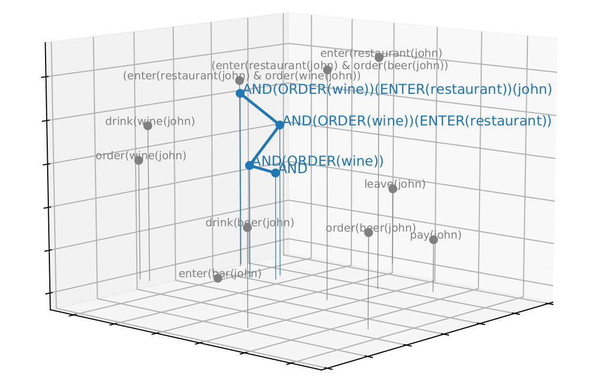

# DFS Semantics Python

This repo is essentially a python implementation (incomplete) of https://github.com/hbrouwer/dfs-tools , notably without sampling. Logic is handled by NLTK's logic package. See https://luuksuurmeijer.github.io/ for the full manuscript of my Master's Thesis "Compositionality in Distributional Formal Semantics".

The goal of this repo is to implement a traditional lambda-calculus style compositional system for Distributional Formal Semantics, i.e. vectors of truth values. This results in the ability to compositionally build sentences from elementary words and phrases. Crucially the compositional trees are graded and each reduction adjusts fuzzy inferential prediction with respect to the Vector Space we are working in.

An example of such a derivation in 3 dimensions:


One example of how to instantiate the prerequisites for a derivation:
```
from dfs_semantics import *
from parsing import *
from MeaningVec import *
import pandas as pd
from itertools import product
from nltk import Tree


# World
#TODO: for now you have to define the types of variables you will be using because I dont know how NLTK's fucking type inferencer works
typesig = {'leave' : '<e, t>', 'askmenu' : '<e, t>', 'pay' : '<e, t>', 'P' : '<e, t>', 'Q' : '<e, t>', 'R' : '<e, <e, t>>', 'S' : '<e, <e, t>>',
        'order' : '<e, <e, t>>', 'drink' : '<e, <e, t>>', 'enter' : '<e, <e, t>>', 'eat' : '<e, <e, t>>'}
world = MeaningSpace(file='worlds/wollic.observations', signature=typesig)
world.additionaltypes()
#operators
AND = MeaningSet(PARSE('\\P \\Q \\x. (P(x) & Q(x))'), world)

#predicates
PAY = MeaningSet(PARSE('\\x. (pay(x))'), world)
LEAVE = MeaningSet(PARSE('\\x. (leave(x))'), world)
DRINK = MeaningSet(PARSE('\\y \\x. (drink(y, x))'), world)
EAT = MeaningSet(PARSE('\\y \\x. (eat(y, x))'), world)
ENTER = MeaningSet(PARSE('\\y \\x. (enter(y, x))'), world)
ORDER = MeaningSet(PARSE('\\y \\x. (order(y, x))'), world)
ASKMENU = MeaningSet(PARSE('\\x. (askmenu(x))'), world)

predicates = [PAY, LEAVE, DRINK, EAT, ENTER, ORDER]

# entities
ellen = PARSE('ellen')
john = PARSE('john')
beer = PARSE('beer')
wine = PARSE('wine')
restaurant = PARSE('restaurant')
bar = PARSE('bar')
pizza = PARSE('pizza')
fries = PARSE('fries')
entities = [ellen, john, beer, wine, restaurant, bar, pizza, fries]

#everything
all = [ellen, john, beer, wine, restaurant, bar, pizza, fries, PAY, LEAVE, DRINK, EAT, ENTER, ORDER]
```

Structure:
- `dfs_semantics.py` Here DFS is implemeneted
- `MeaningVec.py` Meaning Vector object implementation
- `parsing.py` All requirements for parsing strings into First Order Logic (and subsequently DFS)
- `dfs_3dcube.py` Generates the cube plot above
- `inference_plot.py` Generates inference matrix plot
- `gen_tree_plot.py` Generates the compositional plots
- `orthogonality_check.py` Runs some tests on several properties of the mechanism (like negation)
- `testing.py` Some tests on the code
- `worldspec.py` Contains the instantiation of a DFS space that is used in the rest of the code

